## Design


| 模块 (Module) | 核心更新 (Core Update) | 根本原因 (Fundamental Reason) |
| :--- | :--- | :--- |
| **Header** | 增加 `m_message_size` 字段 | **为网络传输附加元数据**，让接收方能预知消息总大小。这是所有上层逻辑实现的物理基础。 |
| **RDMA Hardware** | 实现接收端消息边界检测与回调 | **解决信息不对称问题**。让接收方（而不仅是发送方）能明确知道消息何时接收完毕，从而触发上层逻辑。|
| **RDMA Driver** | 建立精细化的 Tx/Rx 回调映射表 | **实现事件的精确路由**。将底层硬件产生的“匿名”完成事件，精确分派给发起请求的上层应用实例。|
| **Application (RdmaClient)** | 引入内部状态机和操作序列模式 | **将控制逻辑下沉**。使应用接口具备自主驱动复杂通信序列的能力，从而**解耦**算法逻辑与网络事件处理。|
| **NetDevice** | 增加出队统计并优化调度策略 | **解决性能瓶颈**。通过量化诊断和算法替换，提升仿真器本身的数据包处理效率。|

### Application





#### Rdma Client

`RdmaClient` 在 ns-3 仿真环境中扮演着**应用层接口**的角色，专门用于模拟基于 RDMA (远程直接内存访问) 的通信。它的核心作用是**封装和简化底层 RDMA 协议的复杂性**，为上层应用（如 MSCCL 集合通信算法）提供一个清晰、易用的编程接口。

##### 设计理念与作用

1.  **抽象化连接管理**：将 RDMA 的核心概念“队列对”（Queue Pair, QP）的创建、配置和销毁过程抽象化。用户只需指定源/目的地址、端口等高级参数，而无需关心 QP 与底层网络设备的具体绑定细节。
2.  **简化数据传输**：提供简单的 `PushMessage` 或基于操作序列的 `AddOperation` 方法来发起数据传输，隐藏了消息切分、打包、序列号管理等底层细节。
3.  **支持不同通信模式**：
    *   **简单模式**：适用于一次性的数据发送任务。客户端创建、发送消息，然后可以选择在完成后自动销毁 QP (`PassiveDestroy=true`)。
    *   **操作序列模式** (`OperationsRun=true`)：适用于复杂的、多步骤的通信场景（如 MSCCL 中的算法步骤）。客户端内部维护一个操作队列（如 `send`, `recv`），并根据上一步操作的完成回调来驱动下一步，从而精确模拟算法流程。
4.  **事件驱动与回调**：通过 ns-3 的回调机制，将底层事件（如发送完成、接收完成）通知给上层应用，便于应用逻辑的实现，例如统计 FCT、驱动 MSCCL 的下一个 `ThreadBlock` 步骤等。

##### 使用方式

`RdmaClient` 通常与 `RdmaClientHelper` 配合使用，以简化其在仿真脚本中的配置和部署。

1.  **创建与配置 (`RdmaClientHelper`)**：
    *   使用 `RdmaClientHelper` 的构造函数或 `SetAttribute` 方法来配置 `RdmaClient` 的各项参数。
    *   **关键参数**：
        *   `SourceIP` / `DestIP` / `SourcePort` / `DestPort`: 定义通信端点。
        *   `PriorityGroup` (`m_pg`): 指定流量的优先级。
        *   `WriteSize`: 消息大小。
        *   `PassiveDestroy`: 是否在完成所有消息后自动销毁 QP。对于需要复用连接的场景（如 MSCCL），应设为 `false`。
        *   `OperationsRun`: 是否启用操作序列模式。MSCCL 场景下应设为 `true`。
        *   `Callbacks`: 设置消息完成、QP 结束等事件的回调函数。例如，在 `main.cc` 中，`my_message_finish` 被用作回调来记录流完成时间 (FCT)。

2.  **安装到节点 (`Install`)**：
    *   调用 `RdmaClientHelper::Install(NodeContainer)` 方法，将配置好的 `RdmaClient` 应用安装到一个或多个 ns-3 节点上。

3.  **发起通信**：
    *   **简单模式**：在客户端 `StartApplication` 后，通过 `PushMessagetoQp()` 方法将消息推入其关联的 QP。
    *   **操作序列模式**：通过 `AddOperation("send", size)` 或 `AddOperation("recv", size)` 向客户端添加一系列操作。客户端会按照添加的顺序，在前一个操作完成后自动执行下一个。

##### 实现方式简述

1.  **继承 `ns3::Application`**：`RdmaClient` 是一个标准的 ns-3 应用，拥有 `StartApplication` 和 `StopApplication` 等生命周期方法。
2.  **获取底层驱动**：在 `Setup()` 或 `StartApplication()` 阶段，它通过 `GetNode()->GetObject<RdmaDriver>()` 获取所在节点上的 `RdmaDriver` 实例。
3.  **创建队列对 (QP)**：调用 `RdmaDriver::AddQueuePair()` 来请求创建一个 QP。`RdmaDriver` 负责管理和复用 QP，确保相同端点间的通信可以共享同一个 QP。
4.  **发送数据**：当上层调用 `PushMessagetoQp()` 或内部状态机驱动一个 `send` 操作时，`RdmaClient` 会调用其持有的 `RdmaQueuePair` 实例的 `PushMessage()` 方法。
5.  **处理完成事件**：`RdmaClient` 向底层注册回调函数。当 `RdmaDriver` 或 `RdmaHw` 检测到数据包的 ACK 返回，确认消息传输完成时，会触发 `RdmaClient` 注册的 `Finish()` 或 `HandleRxComplete()` 回调，从而驱动上层应用逻辑或内部状态机的运转。

##### Rdma Client 的修改


1.  **引入操作序列模式 (`OperationsRun`)**：
    *   新增了一个布尔属性 `OperationsRun`。当设置为 `true` 时，`RdmaClient` 会进入一种新的工作模式。
    *   在该模式下，`RdmaClient` 内部维护一个操作队列 (`m_operations`)，可以按顺序存储一系列的 `SEND` 和 `RECV` 操作。

2.  **实现内部状态机**：
    *   新增了 `AddOperation(type, size)` 方法，允许上层应用（如 `ThreadBlock`）向客户端注册一系列有序的通信任务。
    *   新增了 `RunNextStep()` 方法，作为状态机的核心驱动。它会按顺序执行队列中的操作。
    *   新增了 `HandleTxComplete()` 和 `HandleRxComplete()` 方法。这两个方法作为从底层 `RdmaDriver` 传来的回调函数，当一个 `SEND` 或 `RECV` 操作完成后，它们会被触发，然后调用 `RunNextStep()` 来启动序列中的下一个操作。

3.  **与 `RdmaDriver` 的深度集成**：
    *   新增了 `AddTxChannel()` 和 `AddRxChannel()` 方法。这些方法用于将 `HandleTxComplete` 和 `HandleRxComplete` 回调函数注册到 `RdmaDriver` 的回调映射表 (`m_txCompleteCallbacks`, `m_rxCompleteCallbacks`) 中。这完成了从底层硬件事件到 `RdmaClient` 状态机的连接。

4.  **生命周期调整 (`Setup` 方法)**：
    *   将 QP 的创建逻辑从 `StartApplication` 移至一个新的 `Setup()` 方法中。
    *   `RdmaClientHelper` 现在会在 `Install` 期间调用 `Setup()`，确保 `RdmaClient` 在 `StartApplication` 之前就已经准备好并创建了 QP。这使得上层应用（`ThreadBlock`）可以在仿真开始前就获取 `RdmaClient` 并注册回调。

5.  **引入“哑客户端”模式 (`DumbClient`)**：
    *   新增了 `DumbClient` 属性。如果一个客户端的源和目的地址/端口完全相同，它会自动进入此模式，并且**不会创建任何 QP**。这主要用于模拟一个纯粹的接收端，它本身不发起连接，只等待接收数据。

###### 修改原因

原版的 `RdmaClient` 只能处理简单的、一次性的发送任务，无法满足 MSCCL 算法中复杂的通信模式，例如“先发送，等待发送完成后再接收”这样的依赖关系。

这些修改的根本原因是为了**将通信的控制逻辑从上层应用（`ThreadBlock`）下沉到 `RdmaClient` 内部**，使其具备自主驱动复杂通信序列的能力：

*   **支持 MSCCL 算法**：`OperationsRun` 模式及其内部状态机，完美地匹配了 `ThreadBlock` 中按步骤执行 `send` 和 `recv` 的需求。`ThreadBlock` 只需在初始化时将所有步骤注册到 `RdmaClient`，之后 `RdmaClient` 就能根据底层的网络完成事件自动执行整个流程。
*   **实现精确的事件驱动**：通过将自己的 `Handle*Complete` 方法注册到底层驱动，`RdmaClient` 现在能够精确地响应**属于它自己的**发送和接收完成事件，而不是像以前一样依赖于一个全局的回调。
*   **提高模块化和解耦**：`RdmaClient` 现在成为了一个更完整的 RDMA 应用层抽象。上层应用只需定义“做什么”（操作序列），而无需关心“如何根据网络事件驱动”，这使得 `ThreadBlock` 的实现可以更专注于算法逻辑本身。

#### GPU And ThreadBlock

`GPUNode` 和 `ThreadBlock` 是 MSCCL 仿真框架中用于模拟集合通信算法执行的核心应用层组件。它们将上层的算法描述（如 XML 文件中定义的 AllReduce）转化为底层的网络传输行为。

##### 设计理念与作用

1.  **`GPUNode`：模拟 GPU 计算节点**
    *   **作用**：`GPUNode` 是 `ns3::Node` 的一个特化版本，代表一个参与计算和通信的 GPU 单元。它作为执行 MSCCL 算法的主体，负责管理和调度其内部的所有 `ThreadBlock`。
    *   **核心职责**：
        *   **算法解析**：在初始化阶段，`GPUNode` 解析 MSCCL 算法 XML 文件，为自己（由 `rank` 标识）加载所有需要执行的 `ThreadBlock`。
        *   **任务调度**：管理其拥有的 `ThreadBlock` 的生命周期，在仿真开始时（`collective_start_time`）启动它们。
        *   **状态跟踪**：记录算法的执行状态，如所有 `ThreadBlock` 是否已完成，并记录最终的完成时间（`m_end_time`），用于性能评估。

2.  **`ThreadBlock` (TB)：模拟算法执行单元**
    *   **作用**：`ThreadBlock` 模拟在 GPU 上执行通信任务的一个工作单元（类似于 CUDA 中的线程块）。它负责执行一个或多个通信通道（`channel`）上的具体算法步骤。
    *   **核心职责**：
        *   **步骤管理**：一个 `ThreadBlock` 包含一个或多个 `ThreadBlockStep`。它内部维护一个状态机，根据步骤之间的依赖关系，依次执行这些步骤。
        *   **驱动网络通信**：当执行到一个 `send` 或 `recv` 步骤时，`ThreadBlock` 会调用其关联的 `RdmaClient` 的 `AddOperation` 方法，将网络传输任务提交给 RDMA 模拟层。
        *   **响应网络事件**：`ThreadBlock` 通过 `SetAboveLayerCallback` 方法将自己的 `SendComplete` 和 `RecvComplete` 方法注册为 `RdmaClient` 的回调。当底层 `RdmaClient` 完成一次 `send` 或 `recv` 操作后，会通过这些回调通知 `ThreadBlock`，从而驱动其状态机进入下一个步骤。

3.  **`ThreadBlockStep`：原子通信操作**
    *   **作用**：代表 MSCCL 算法中的一个原子操作，通常是 `send` 或 `recv`。它定义了单次通信的全部参数，如操作类型、数据来源/目的地、数据量以及依赖关系等。

##### 使用与交互流程

1.  **初始化**：
    *   仿真脚本（如 `main.cc` 中的 `SetupNetwork`）首先创建 `GPUNode` 节点。
    *   `GpuThreadBlockHelper` 被用来解析算法 XML 文件，并根据文件内容在每个 `GPUNode` 上创建相应的 `ThreadBlock` 和 `ThreadBlockStep` 实例。
    *   在创建 `ThreadBlock` 的同时，会为其创建专用的 `RdmaClient` 实例（工作在 `OperationsRun=true` 模式下），并建立起两者之间的回调链接。

2.  **执行**：
    *   仿真到达 `collective_start_time` 时，每个 `GPUNode` 启动它的所有 `ThreadBlock`。
    *   `ThreadBlock` 开始执行其内部的第一个（无依赖的）`ThreadBlockStep`。
    *   如果步骤是 `send`，`ThreadBlock` 调用 `RdmaClient::AddOperation("send", ...)`。
    *   `RdmaClient` 将操作加入其内部队列，并通过底层的 `RdmaDriver` 和 `RdmaHw` 模拟数据包的发送。
    *   当消息被确认接收（ACK 返回）后，`RdmaHw` -> `RdmaDriver` -> `RdmaClient` 的完成事件链被触发。
    *   `RdmaClient` 调用 `ThreadBlock` 注册的 `SendComplete` 回调。
    *   `ThreadBlock` 收到回调后，更新内部状态，标记当前步骤完成，并查找下一个可以执行的步骤，循环此过程。
    *   当一个 `GPUNode` 上的所有 `ThreadBlock` 都完成了它们的所有步骤，该 GPU 的集合通信任务便宣告结束。

##### 实现方式简述

*   **`GPUNode`** 继承自 `ns3::Node`，通过添加 `rank`、`ThreadBlock` 列表和 `m_end_time` 等成员变量来扩展其功能。
*   **`ThreadBlock`** 是一个独立的 `ns3::Object`，其核心是一个状态机（`RunNextStep`），由 `Start()` 方法启动，并由 `RdmaClient` 的回调驱动。
*   **`GpuThreadBlockHelper`** 负责将配置（XML）与模型（`GPUNode`, `ThreadBlock`）连接起来，是典型的 ns-3 Helper 设计模式。
*   **解耦设计**：上层 `ThreadBlock` 只关心算法逻辑（步骤和依赖），底层 `RdmaClient` 只关心如何可靠地传输数据。两者通过 `AddOperation` 和回调函数清晰地解耦，使得上层算法逻辑和底层网络协议可以独立演进。


### RDMA

#### Driver

对 `RdmaDriver` 的修改主要是为了**增强其作为应用层与底层硬件之间桥梁的能力**，特别是为了支持 MSCCL 复杂的、基于步骤的通信模式。核心目标是**建立一个精细化的回调机制**，使得上层应用（如 `RdmaClient` 和 `ThreadBlock`）能够精确地响应特定连接上的发送（Tx）和接收（Rx）完成事件。

##### 修改内容

1.  **引入 Tx/Rx 完成回调映射表**：
    *   在 `rdma-driver.h` 中，添加了两个 `std::map` 成员：`m_txCompleteCallbacks` 和 `m_rxCompleteCallbacks`。
    *   `m_txCompleteCallbacks`：将一个 QP Key（唯一标识一个由本地发起的连接）映射到一个 `Callback<void>`。用于在**发送方**得知消息已被成功接收（收到 ACK）时，通知上层应用。
    *   `m_rxCompleteCallbacks`：一个二级映射，将 QP Key 和源 IP 地址映射到一个 `Callback<void>`。用于在**接收方**收到一个完整的消息时，通知上层应用。

2.  **新增 Tx/Rx 完成处理函数**：
    *   `MessageTxComplete()`：当底层 `RdmaHw` 确认一个已发送的消息完成时（通过原有的 `MessageComplete` 触发），此函数被调用。它会在 `m_txCompleteCallbacks` 中查找并执行对应的回调，从而通知发送方应用。
    *   `MessageRxComplete()`：当底层 `RdmaHw` 接收到一个完整的消息时，此函数被调用。它会在 `m_rxCompleteCallbacks` 中查找并执行对应的回调，通知接收方应用。

3.  **扩展底层硬件接口**：
    *   修改了 `RdmaDriver::Init` 中对 `m_rdma->Setup` 的调用，将新增的 `MessageRxComplete` 方法作为回调函数注册到底层 `RdmaHw`。这使得 `RdmaHw` 能够在接收完成时直接通知 `RdmaDriver`。

##### 修改原因

原有的回调机制比较粗略，只能笼统地触发消息完成事件，无法区分是哪个连接的哪个操作（发送还是接收）完成了。为了实现 MSCCL 算法中 `ThreadBlock` 的精确状态机驱动（即一个 `send` 操作完成后才能触发下一个依赖它的 `recv` 或 `send`），必须建立一个更精细的事件通知系统。

通过这些修改，`RdmaDriver` 现在能够：
*   **区分发送与接收**：为 Tx 和 Rx 完成事件提供了独立的处理逻辑和回调注册表。
*   **精确定位连接**：使用唯一的 QP Key 来标识通信会话，确保回调被分派给正确的上层应用实例（`RdmaClient`）。
*   **支持复杂应用逻辑**：使得 `RdmaClient` 可以在 `OperationsRun` 模式下，将自己的 `HandleTxComplete` 和 `HandleRxComplete` 方法注册到 `RdmaDriver`，从而在其内部驱动 `send` -> `recv` -> `send`... 这样的操作序列，完美匹配了 `ThreadBlock` 的执行需求。

#### Hardware

对 `RdmaHw` 模块的核心目标是**让接收方（Receiver）能够准确地知道一个完整的消息何时被接收完毕**，并向上层（`RdmaDriver`）触发一个特定的接收完成事件。

##### 修改内容

1.  **在数据包头部中嵌入消息总长度**：
    *   在 `GenDataPacket` 函数中，修改了数据包的生成逻辑。当 `RdmaHw` 发送一个新消息的**第一个数据包**时，会将该消息的**总字节数**写入 `SimpleSeqTsHeader` 头部的一个特殊字段 (`message_size`)。
    *   对于该消息的后续数据包，该字段将被设置为一个特殊值 (`UINT64_MAX`)，表示它们不是消息的起始包。

2.  **在接收端跟踪消息接收进度**：
    *   为接收队列对 `RdmaRxQueuePair` 增加了一个新成员变量 `m_curMessageSize`，用于在接收端跟踪当前正在接收的消息的剩余字节数。
    *   在 `ReceiveUdp` 函数中：
        *   当接收到一个数据包时，会检查其 `message_size` 头部字段。如果这是一个消息的起始包，`RdmaHw` 就会用头部的消息总长度来初始化 `m_curMessageSize`。
        *   对于收到的每一个有效数据包，`RdmaHw` 都会从 `m_curMessageSize` 中减去当前数据包的载荷大小。

3.  **实现并触发接收完成回调**：
    *   **当 `m_curMessageSize` 减至 0 时，即表示接收方已成功接收了一个完整的消息。**
    *   此时，`ReceiveUdp` 函数会立即调用一个新的回调函数 `m_messageRxCompleteCallback`，将当前连接的 QP Key 和源 IP 地址作为参数，向上通知 `RdmaDriver`。
    *   `RdmaHw::Setup` 接口被扩展，用于从 `RdmaDriver` 接收并注册这个新的回调函数。

##### 修改原因

原有的 `RdmaHw` 只能通过 ACK 机制告知**发送方**消息已发送完成 (`MessageCompleteCallback`)，但**接收方**本身缺乏一个明确的“消息接收完毕”的信号。

对于 MSCCL 算法中的 `recv` 操作，上层应用（`ThreadBlock`）必须知道数据何时已完整到达本地，才能继续执行后续的计算或通信步骤。

通过上述修改，`RdmaHw` 现在具备了在数据流层面识别消息边界的能力：
*   **发送方“标记”**：在数据流的开头标记出消息的总长度。
*   **接收方“计数”**：通过递减计数器来跟踪消息的接收进度。
*   **精确触发**：在消息的最后一个字节到达时，能够立即、精确地向上层触发一个**接收完成**事件。

这个机制是实现 `RdmaDriver` 和 `RdmaClient` 中 `RxComplete` 回调链的基础，最终使得 `ThreadBlock` 的 `recv` 操作能够被正确地驱动。

#### QueuePair

对 `RdmaQueuePair`（发送端）和 `RdmaRxQueuePair`（接收端）的修改，主要是为了**修复 Bug** 和 **增加新功能所需的状态变量**，以支持上层 `RdmaHw` 的新机制。

##### 修改内容

1.  **为 `RdmaMessage` 增加 `m_setupd` 标志位**：
    *   在 `RdmaQueuePair.h` 中，为发送队列中的 `RdmaMessage` 结构体增加了一个布尔成员 `m_setupd`，默认为 `false`。
    *   在 `RdmaQueuePair::PushMessage` 和 `RdmaHw::QpCompleteMessage` 中，设置消息的起始序列号 (`m_startSeq`) 的逻辑现在被 `if (msg.m_setupd == false)` 条件包裹。一旦设置，`m_setupd` 会被置为 `true`。

2.  **为 `RdmaRxQueuePair` 增加 `m_curMessageSize` 状态变量**：
    *   在 `RdmaQueuePair.h` 中，为接收队列对 `RdmaRxQueuePair` 增加了一个 `uint64_t` 类型的成员 `m_curMessageSize`。
    *   这个变量由 `RdmaHw` 在 `ReceiveUdp` 函数中进行管理，用于在接收端跟踪当前正在接收的消息的剩余字节数。

##### 修改原因

1.  **修复 `m_startSeq` 被重复更新的 Bug**：
    *   此前的代码存在一个逻辑缺陷：一个消息的起始序列号 `m_startSeq` 在其生命周期中可能被错误地更新两次（一次在 `PushMessage`，一次在 `QpCompleteMessage`）。
    *   引入 `m_setupd` 标志位，确保了 `m_startSeq` 只在消息首次准备发送时被设置一次，彻底解决了这个问题。这对应了 `TODO List` 中已完成的修复项。

2.  **支持接收端的消息边界检测**：
    *   为了让 `RdmaHw` 能够判断一个完整的消息是否接收完毕，它需要在接收端（`RdmaRxQueuePair`）有一个地方来存储和更新当前消息的接收进度。
    *   新增的 `m_curMessageSize` 成员就充当了这个“计数器”的角色。`RdmaHw` 在收到消息的第一个包时用消息总长度初始化它，之后每收到一个包就减去相应的字节数。当它减到 0 时，就意味着消息接收完成。这个状态变量是实现 `MessageRxComplete` 回调机制的必要基础。

##### 关联与协作

`RdmaQueuePair` 中的 `m_curMessageSize` 是整个接收完成回调链的起点。整个流程如下：

1.  **状态跟踪 (`RdmaRxQueuePair`)**：`m_curMessageSize` 在接收端 QP 中跟踪消息的剩余大小。
2.  **事件触发 (`RdmaHw`)**：当 `m_curMessageSize` 减为 0 时，`RdmaHw` 知道消息已完整接收，并触发 `MessageRxComplete` 回调。
3.  **事件路由 (`RdmaDriver`)**：`RdmaDriver` 接收到该事件，并根据 QP Key 在其 `m_rxCompleteCallbacks` 映射表中查找并调用上层注册的回调。
4.  **事件处理 (`RdmaClient`)**：`RdmaClient` 的 `HandleRxComplete` 方法被调用，它进而更新其内部的操作序列状态机 (`OperationsRun` 模式)，并触发上层应用（如 `ThreadBlock`）的 `RecvComplete` 回调。

这个完整的链条将底层的硬件状态（`m_curMessageSize`）与高层的应用逻辑（`ThreadBlock` 的步骤执行）精确地连接了起来。


### NetDevice

对 `QbbNetDevice` 模块的修改，其核心目标是**诊断和优化数据包的出队与发送性能**。此前在性能分析（Profiling）中发现，`DequeueAndTransmit` 函数占用了大量的 CPU 时间，表明其执行效率存在瓶颈。为了解决此问题，引入了以下修改：

##### 修改内容

1.  **新增出队行为统计功能**：
    *   在 `QbbNetDevice` 类中增加了两个计数器：`m_hasPacketCount` 和 `m_noPacketCount`。
    *   这两个计数器被集成到 `DequeueAndTransmit` 和 `SwitchDequeueAndTransmit` 函数的核心逻辑中。每当调用这些函数时：
        *   如果成功找到并出队一个数据包用于发送，则 `m_hasPacketCount` 加一。
        *   如果因为队列暂停（PAUSE）或无可用数据包而未能发送，则 `m_noPacketCount` 加一。
    *   新增了 `PrintDequeueStats` 方法，该方法会在设备销毁时自动调用，用于打印详细的统计报告，包括 `DequeueAndTransmit` 的总调用次数、成功找到数据包的次数与比例，以及空转（未找到数据包）的次数与比例。

2.  **更改默认出队调度模式**：
    *   在 `RdmaEgressQueue` 的类型定义中，将 `TxDequeueMode` 属性的默认值从 `DWRR` (Deficit Weighted Round Robin) 更改为 `QP_AVAIL`。

##### 修改原因

1.  **为性能优化提供数据支持**：
    *   `DequeueAndTransmit` 的高 CPU 占用率是一个严重的性能问题。新增的统计功能为此问题的诊断提供了关键数据。通过分析“成功出队”与“空转”的比例，开发者可以判断调度器唤醒 `DequeueAndTransmit` 的效率。
    *   如果 `m_noPacketCount` 的比例过高，则说明设备被频繁唤醒但无事可做，造成了 CPU 资源的浪费。这些统计数据是评估后续优化措施（如更改调度算法）是否有效的客观依据。

2.  **尝试更高效的出队策略**：
    *   `DWRR` 是一种相对复杂的加权公平调度算法，虽然能保证公平性，但在某些场景下可能会引入不必要的计算开销。
    *   将默认模式更改为 `QP_AVAIL`（推测为一种更简单的、基于队列可用性的轮询模式），目的是为了**降低调度算法本身的复杂度**，减少在选择下一个要发送的数据包时所花费的 CPU 时间，从而直接应对 `DequeueAndTransmit` 的性能瓶颈。

总而言之，这些修改构成了一个完整的“诊断-优化”闭环：通过引入精细化的统计来量化问题，然后通过改变核心调度算法来尝试解决问题。

### Header

对数据包头部的修改是实现**接收端消息边界检测**机制的物理基础。核心改动是在 `SimpleSeqTsHeader` 中增加了一个关键字段，以在网络中传递必要的信息。

##### 修改内容

1.  **在 `SimpleSeqTsHeader` 中增加 `m_message_size` 字段**：
    *   向 `SimpleSeqTsHeader` 类中添加了一个 `uint64_t m_message_size` 成员变量。
    *   相应地，更新了该头部的序列化 (`Serialize`)、反序列化 (`Deserialize`) 和获取大小 (`GetSerializedSize`) 的方法，以包含这个新字段。
    *   `CustomHeader` 也被同步修改，以在其内部结构中包含这个新字段。

##### 修改原因

这个 `m_message_size` 字段是整个**接收完成回调机制**的基石，其作用与 `RdmaHw` 模块的修改紧密相关：

*   **承载消息总长度**：当 `RdmaHw` 发送一个新消息的**第一个数据包**时，它会将该消息的**总字节数**写入这个 `m_message_size` 字段。
*   **通知接收端**：当这个数据包到达接收端时，接收方的 `RdmaHw` 会读取 `m_message_size` 字段的值，从而得知需要接收多少字节才能构成一个完整的消息。
*   **实现精确触发**：接收方 `RdmaHw` 使用这个总长度作为“计数器”的初始值。每收到一个后续数据包，就减去其载荷大小，当计数器减至 0 时，便可精确地判断消息已完整接收，并触发 `MessageRxComplete` 事件。

简而言之，这个头部字段的修改，是在数据包层面实现了发送方到接收方关于消息大小的“带外信令”（in-band signaling），是驱动 `RdmaClient` 中 `recv` 操作和 `ThreadBlock` 状态机正确运转的底层保障。


## MSCCL Setup and Simulation

在 ns-3 环境中模拟 MSCCL 算法遵循一个结构化的设置和执行流程，该流程主要由 main.cc 编排，并通过运行时指定的配置文件进行参数化。整个过程可以分解为以下几个关键阶段：

1.  **配置加载 (`ReadConf`)**
    *   **入口**：仿真的第一步是解析一个配置文件（例如 config.sh）。
    *   **内容**：该文件定义了仿真的所有核心参数，包括：
        *   **仿真时间**：`SIMULATOR_START_TIME`, `SIMULATOR_STOP_TIME`。
        *   **拓扑与算法**：`TOPOLOGY_FILE`, `ALGO_FILE`，分别指向定义网络结构和 MSCCL 算法的外部文件。
        *   **网络特性**：`DATA_RATE`, `LINK_DELAY` 定义了链路的基本属性。
        *   **组件参数**：为 ns-3 的各个模块（如 `RdmaHw`, `QbbNetDevice`）设置详细的内部参数，例如拥塞控制模式 (`CC_MODE`)、MTU (`PACKET_PAYLOAD_SIZE`) 等。

2.  **网络拓扑构建 (`SetupNetwork`)**
    *   **节点创建**：根据 `TOPOLOGY_FILE` 文件中的定义，创建网络中的所有节点。节点被区分为三种类型：
        *   `GPUNode` (类型 0): 代表运行 MSCCL 任务的服务器/主机。
        *   `SwitchNode` (类型 1): 普通的网络交换机。
        *   `NVSwitchNode` (类型 2): 模拟支持 RDMA 路由的 NVSwitch。
    *   **链路与协议栈安装**：
        *   在所有节点上安装标准的互联网协议栈 (`InternetStackHelper`)。
        *   根据拓扑文件中的链路定义，使用 `QbbHelper` 在节点之间创建点对点链路，并配置其数据速率和延迟。
        *   为所有节点分配 IP 地址。
        *   在所有节点上安装 RDMA 协议栈，包括 `RdmaDriver` 和 `RdmaHw`。

3.  **路由计算与设置 (`CalculateRoutes` & `SetRoutingEntries`)**
    *   **路径发现**：在网络拓扑构建完成后，系统会为每个 `GPUNode` 运行一个基于广度优先搜索（BFS）的路由算法 (`CalculateRoute`)，以计算到所有其他节点的最短路径。
    *   **路由表填充**：计算出的路由信息被用来填充网络中各个节点的路由表：
        *   对于 `SwitchNode`，路由条目被添加到其转发表中。
        *   对于 `GPUNode` 和 `NVSwitchNode`，路由信息被添加到其 `RdmaDriver` 的路由表中，以指导 RDMA 流量的下一跳。

4.  **MSCCL 应用层设置**
    *   **算法解析**：`GpuThreadBlockHelper` 负责解析 `ALGO_FILE`（一个 XML 文件），该文件详细描述了 MSCCL 集合通信算法（如 AllReduce）的每个步骤。
    *   **组件实例化**：
        *   Helper 根据 XML 内容，在每个 `GPUNode` 上创建相应的 `ThreadBlock` 实例。每个 `ThreadBlock` 对应算法中的一个工作单元。
        *   每个 `ThreadBlock` 内部包含一系列 `ThreadBlockStep`，代表原子的 `send` 或 `recv` 操作。
    *   **建立通信链路**：
        *   为每个 `ThreadBlock` 创建一个专用的 `RdmaClient` 实例（工作在 `OperationsRun=true` 模式）。
        *   通过调用 `RdmaClient` 的 `AddTxChannel` 和 `AddRxChannel` 方法，将 `ThreadBlock` 的 `SendComplete` 和 `RecvComplete` 回调函数注册到 `RdmaDriver` 的回调映射表中。这建立了一条从底层硬件事件到上层应用逻辑的完整通知链。

5.  **仿真执行与监控**
    *   **启动**：仿真在 `simulator_start_time` 开始。MSCCL 集合通信操作在 `collective_start_time` 被触发，此时所有 `GPUNode` 开始执行其 `ThreadBlock`。
    *   **执行流程**：`ThreadBlock` 按照内部步骤的依赖关系，通过其关联的 `RdmaClient` 发起 `send` 和 `recv` 操作。底层 RDMA 模块完成传输后，通过回调链通知 `ThreadBlock`，驱动其状态机进入下一步，直至所有步骤完成。
    *   **监控 (可选)**：如果配置了监控文件，仿真过程中会定时 (`schedule_monitor`) 采集并记录关键性能指标，如交换机队列长度、链路带宽利用率、QP 发送速率等。
    *   **结束**：仿真运行至 `simulator_stop_time` 结束。在结束时，`QbbNetDevice` 会打印出队行为的统计数据，帮助分析性能瓶颈。


## Script to Measure

为了便于性能评估和参数调优，提供了一系列自动化测量脚本。

### get_time.sh - 测量模拟完成时间 (FCT)

此脚本用于测量在不同 `chunkSize`（块大小）下，MSCCL 算法在**模拟环境内**的完成时间（Flow Completion Time, FCT）。

*   **功能**：
    1.  从 8KB 开始，以 2 的倍数递增 `chunkSize`，直至达到用户指定的上限。
    2.  在每次迭代中，自动使用 `sed` 修改配置文件 (config.sh) 中的 `ns3::ThreadBlock::chunkSize` 参数。
    3.  运行 `scratch/msccl/main` 仿真，并从标准输出中解析出所有 GPU rank 的平均完成时间。
    4.  将 `chunkSize` 与对应的 FCT 保存到 sim-results 目录下的 `*_results.txt` 文件中。
    5.  调用 `gnuplot` 和 chunk_size_2_time.gp 脚本，根据结果数据生成 PDF 格式的性能曲线图。

*   **使用方法**：
    ```bash
    # -l: 指定 chunk size 的上限 (单位: KB)
    # -o: 指定输出文件的前缀
    ./get_time.sh -l 41943 -o allreduce_ring_8_1
    ```
    执行后会生成 allreduce_ring_8_1_results.txt 和 allreduce_ring_8_1_plot.pdf。

### get_execution_time.sh - 测量物理执行时间

此脚本用于测量 ns-3 仿真进程本身的**物理执行时间**（Wall-Clock Time），以评估不同 `chunkSize` 对仿真器性能的影响。

*   **功能**：
    1.  与 get_time.sh 类似，按 2 的倍数迭代 `chunkSize`。
    2.  在每次迭代中，使用 `date` 命令记录 ns-3 进程开始前和结束后的时间戳，计算出实际消耗的物理时间。
    3.  将 `chunkSize` 与对应的物理执行时间保存到 sim-time 目录下的 `*_results.txt` 文件中。
    4.  同样使用 `gnuplot` 生成性能图表。

*   **使用方法**：
    ```bash
    # -l: 指定 chunk size 的上限 (单位: KB)
    # -o: 指定输出文件的前缀
    ./get_execution_time.sh -l 131072 -o execution_time_comparison
    ```
